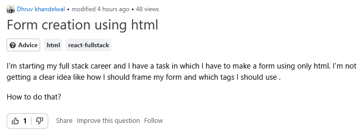
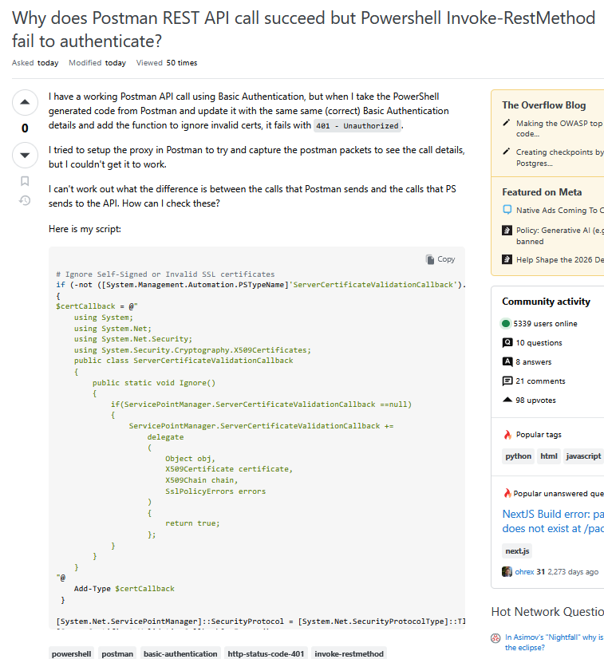

## Introduction
  While I don't code as frequently as I should be in such a field, I find that I follow a certain style that picks up from previous courses, such traits include using tab for indents to symbolize nested code and things such as keeping closed curly braces on their own line, lined up with their opening curly brace. After playing around with eslint, having to set it up within each project, which can be tedious but not too big of a deal, I would say it took some time getting use to the specific style they follow. 
  

## Conclusion and Use of AI

  

  AI was used in the planning stage of creating this essay, once again for structuring but also for ensuring certain questions on Stack Overflow were smart or not smart questions only after applying Raymond's rubric. However, the analysis, interpretations, and final written content were reviewed and written in my own words to reflect my understanding of the material.
