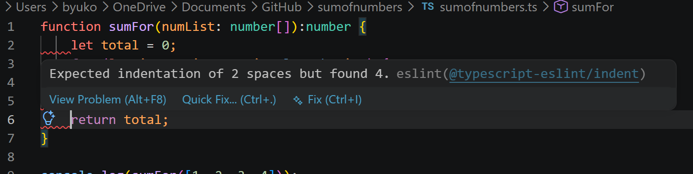

## Introduction

While I do not code as frequently as I would like, I have developed certain coding habits from previous courses. These include consistent indentation, brace placement, and other formatting conventions. After working with ESLint in this course, I also had to adapt to a more formal set of coding rules. While computers can execute code regardless of its formatting, coding standards play an important role in making code easier for people to read and understand. However, I believe coding standards extend beyond formatting choices and can influence how programmers structure, maintain, and even learn a programming language.

## Sharing Your Code

As previously mentioned, while stylistic choices such as indentation and bracket placement aren’t dealbreakers, having clear names for variables and functions plays a key role in making your code readable. When working with others, I feel that it is common sense to want to know what is going on through their heads and specifically what they are trying to do. One such example is when, during my ICS algorithms course, while working with a group, a group member played a major role in writing code, and while we all had the same idea of how we wanted to achieve the goal, their writing made the variables very vague, making it hard to follow, even though we all had the same idea.

And while scenarios like this are typically resolved with more time and experience working with others, I still find it crucial to make your code easier to read and follow. Of course, this also applies to collaborating with other coders, but can also apply to referring to your own code. Many people, not including myself, tend to code on a near daily basis, and that amount of work can make it easier to forget previous projects or even parts of a larger project, making it important to recall what each poriton of code is contributing to what.

I also agree that coding standards can make it easier to learn a programming language. As someone who is still developing my programming skills, I find that consistent code is often easier to understand than code that achieves the same result in several different ways. Standards encourage programmers to organize functions similarly, use descriptive names, and follow common patterns within a language. When I read code that follows these conventions, I can focus more on understanding the concepts and features of the language rather than trying to decipher what the programmer intended. In that sense, coding standards do more than improve readability; they can also serve as a guide for learning how a language is commonly used.

## On the Contrary & ESlint

While I understand the benefits of coding standards, my experience with ESLint has been somewhat mixed. Prior to this course, I had already developed stylistic habits such as indenting, brace placement, and code formatting. As a result, having to constantly fix issues such as using two spaces for indentation as opposed to using tabs did feel a bit restricting. This, among some other minor things, made fixing my code tedious and slightly annoying.

However, I do see the benefit of ESLint, especially for newer, less experienced coders, and I soon began to understand its purpose. The goal is not necessarily to determine the one “correct” style, but rather to ensure that everyone follows the same style. While I may still prefer some formatting choices over others, having a consistent standard makes code easier to read, review, and maintain across a team. In that sense, the inconvenience of adapting to a common standard may be outweighed by the long-term benefits it provides. I do believe that everyone should have the freedom of coding in a style that is most comfortable to them, so long as it doesn’t interfere with others’ abilities to read and understand it. More importantly, however, I feel that everyone should at least remain consistent with their code.

## Conclusion and Use of AI

At the end of the day, I feel that coding standards play a large role in creating more intuitive and cooperative coders. Tools that enforce standards, such as ESLint, can be useful to some but a hassle for others, and I still have my own preferences when it comes to formatting and organization. However, throughout my experiences working both independently and with others, I have come to appreciate the value of consistency and readability. Coding standards are not simply about deciding where a brace should go or whether tabs are better than spaces; they help programmers communicate their ideas more clearly, collaborate more effectively, and better understand the languages they use. While I believe programmers should have some flexibility in how they write their code, maintaining clear and consistent standards ultimately benefits both the programmer and everyone who may read their work in the future.

Much like other essays, I consulted ChatGPT during the planning phase of this assignment: regarding formatting the essay. I have also utilized other tools, including Grammarly for spellchecks, typos, and grammar.
