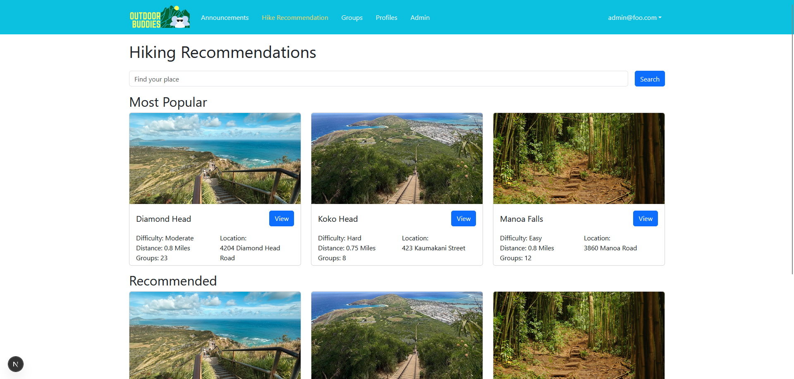

## Introduction

A great chef does not begin every dish by inventing an entirely new method of cooking. Instead, they rely on years of experience, proven techniques, and recipes refined over time. A recipe provides a foundation, but it can still be adapted with different ingredients, flavors, and approaches to create something unique. This balance between consistency and creativity is what allows chefs to continue innovating while still relying on methods that are known to work. Much like chefs, software developers face a similar challenge when creating an application. Rather than purely solving the problem from scratch each time, they adapt and utilize established solutions known as design patterns.

This essay explores the role of design patterns in application development and how these concepts can be applied in practice. By examining the design patterns used throughout my final project, I will discuss how these approaches helped shape the structure, organization, and maintainability of the application.

## What Are Design Patterns?

A recipe does not always guarantee a chef will make the same dish, but rather, it provides a framework that guides the cooking process while still allowing room for creativity and adaptation. Design patterns function similarly within software development. Instead of being code that a developer would copy and paste into every project, they are instead, established approaches for solving common programming problems. These patterns provide developers with a reliable structure while still allowing them to adapt their solutions to the unique needs of each project. By using design patterns, developers can create applications that are easier to understand, maintain, and expand over time. 

## Applying Design Patterns in Our Final Project

During the development of my hiking groups and trails application, I encountered many of the same challenges that design patterns are designed to address. As the application expanded to include features such as trail information, announcements, and future event creation, organizing the code and data became increasingly important. Rather than creating separate solutions for every individual page or feature, I focused on creating reusable structures that could support future growth. Similar to how a chef prepares ingredients and uses established techniques before creating a complex dish, developers must establish a strong foundation before building larger applications.

One example of this was the use of reusable components within the application. Rather than creating separate code for every trail or announcement displayed on the website, I created components that provide a consistent structure while accepting different data. For example, a trail card can display information about different hikes while maintaining the same layout and functionality. Similar to how a chef can use the same recipe while changing ingredients to create different dishes, components allow developers to maintain consistency while still creating unique experiences for users.

Another important design decision in my application was the organization of data through schemas. This allowed the information to be stored and structured in a way I wanted. Similar to how a chef must organize ingredients and understand the role of each ingredient before preparing a dish, an application needs a clear structure for managing the data it uses. By defining models for information such as trails and events, I was able to create a consistent foundation that allows the application to store, retrieve, and display information more effectively. For example, my Trail schema defines the information each trail should contain, such as its name, location, difficulty, and distance. Instead of manually creating a different structure for every trail, each new trail follows the same model. This makes it easier to add new trails in the future while keeping the data consistent.

In addition to organizing how information is displayed and stored, our application also benefits from separating different responsibilities throughout the development process. A well-structured application does not place every task in one location. Instead, each part of the system focuses on a specific purpose. Similar to how a restaurant operates with different roles for preparing ingredients, cooking meals, and serving customers, software applications are easier to manage when different parts of the code have clearly defined responsibilities. In our project, this separation can be seen through the relationship between components, forms, and database models. Components are responsible for presenting information to users, such as displaying trails or announcements, while forms allow users to provide new information, such as creating future events. The schemas define how that information is stored and organized in the database. By separating these responsibilities, changes can be made to one part of the application without requiring the entire system to be rewritten.

## Conclusion & AI Usage

Just as chefs rely on proven techniques and recipes while still creating unique dishes, software developers rely on design patterns to create applications that are organized, adaptable, and maintainable. Design patterns do not limit creativity, but rather, they provide a foundation that allows developers to focus on solving new problems rather than repeatedly solving problems that have already been addressed. Through the development of my hiking groups and trails application, I saw how these principles could be applied through reusable components, structured data models, and separation of responsibilities. By using these approaches, I was able to create a stronger foundation for future features and better understand how experienced developers organize and build software.

I used AI tools such as ChatGPT and Grammarly as a support resource during the writing process. AI was used to help brainstorm the structure of the essay, refine explanations, and clarify concepts related to design patterns. The ideas, examples, and final writing were reviewed and adapted by me to reflect my own understanding and experience developing the project.
