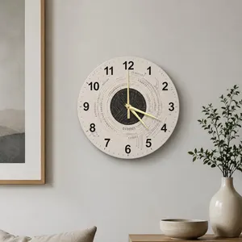

## Introduction
Starting out, I did not have a strong understanding of how much time I needed to complete different tasks, resulting in inconsistent time estimates. Through each passing WOD, I gradually became more confident not only in my ability to complete tasks independently, but also in my ability to judge how much effort they would require. This experience helped me develop a better sense of estimation leading up to the final project. I would later find that estimating a larger software project presented challenges that were difficult to anticipate from individual assignments.

## Making and Using My Estimates
When making my estimates for the final project, I primarily based them on my experience completing previous WODs and how difficult I believed each task would be, accounting for a little extra time to change parts unique to the project. For instance, I would utilize design patterns that I noticed and make a rough estimate based on how long it took me to complete the WOD for that feature. This gave me a point of reference when estimating tasks that involved technologies or concepts I had encountered before. However, I had very little historical data for larger tasks that involved multiple parts of the application, so my estimates became less reliable when I was working on features that required more than simply implementing the code. For example, the search bar and filters, while manageable with outside resources and sometimes AI, required me to consider more than just writing the code itself. I had to account for understanding the existing code, integrating the functionality with the rest of the application, and testing whether the search and filters behaved as expected. This made me realize that having experience with a similar WOD could give me a starting point for an estimate, but it did not necessarily account for all of the work involved in implementing that feature within a larger application.

  

While my estimates were off more often than not, even if only by a small amount, I felt they helped create a sense of urgency around certain larger tasks and encouraged me to address them sooner rather than later. For instance, I was significantly off in estimating the time I would spend working on the Playwright testing, but I appreciated that I started working on it earlier in the project. Had I waited until closer to the deadline to begin testing, I likely would not have had enough time to deal with the problems that arose. More generally, having estimates for different tasks also helped me decide which features to address first before moving on to another task. Even when the estimates were not completely accurate, they still gave me a better idea of which tasks could require more of my time and therefore needed to be prioritized.

## Tracking My Actual Effort
Tracking my actual effort was useful because it allowed me to compare my original estimates with the amount of time I spent on each task. Looking back at my estimates, I noticed that I consistently underestimated my tasks rather than sometimes overestimating and sometimes underestimating them. However, the degree of underestimation varied depending on the task. Some estimates were relatively close to the actual effort, while others were significantly higher than I anticipated, particularly tasks involving testing and debugging. For example, I estimated the M3 Playwright tests at four hours, but recorded around 10.2 hours of coding and non-coding effort. In comparison, my estimate for the trails seeded data was one hour, while the recorded effort was approximately 1.5 hours. Comparing these differences helped me realize that my estimates were not necessarily unreasonable starting points. However, I consistently failed to account for the additional effort that could arise from debugging, testing, and troubleshooting.

  

As for tracking my effort, I didn’t utilize a tool such as a timer. Instead, I used a more informal method where I would pay attention to the time when I started and finished working on a task. I would then roughly subtract the amount of time I spent taking breaks or doing something unrelated to the task. This allowed me to get a general idea of how long I had actually spent working without having to constantly start and stop a timer. However, I recognize that this method was not completely accurate. Since I was estimating my break times and relying on my memory of when I started and stopped working, there was room for error. I believe my tracking was accurate enough to identify general differences between my estimates and actual effort, but it would not have been precise enough to confidently measure my time down to the minute.

## Reflection (What Would I Change?)
If I were to estimate and track my effort for another project, I would continue to use previous experience and similar tasks as a starting point, but I would account more carefully for the work beyond simply writing the code. My estimates tended to be too low because I did not consistently account for testing, debugging, troubleshooting, and integrating new features with the existing application. For larger tasks, I would also break the task into smaller parts and estimate each part separately rather than assigning one estimate to the entire feature. This would make it easier to identify which parts of a task may require additional time and would likely make my estimates more accurate. Additionally, I would use a timer or other time-tracking tool to get a more accurate measurement of the actual time I worked on each feature. This would give me more reliable historical data that I could use when making estimates for future projects.

I did not use AI tools specifically for estimating or tracking effort during this project. So while not utilized for this project specifically for estimating or tracking effort, I would also incorporate AI to help determine how long a task may take while also providing my own experience with the task. For example, I could give an AI tool information about a feature, how much experience I have with the technologies involved, and how long similar tasks have taken me in the past. I could then compare the AI-generated estimate with my own estimate rather than relying entirely on one or the other. I think this could be particularly useful for larger tasks where I have less historical data to base my estimates on.
