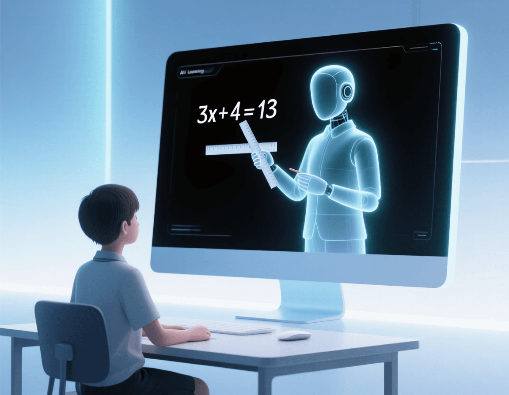
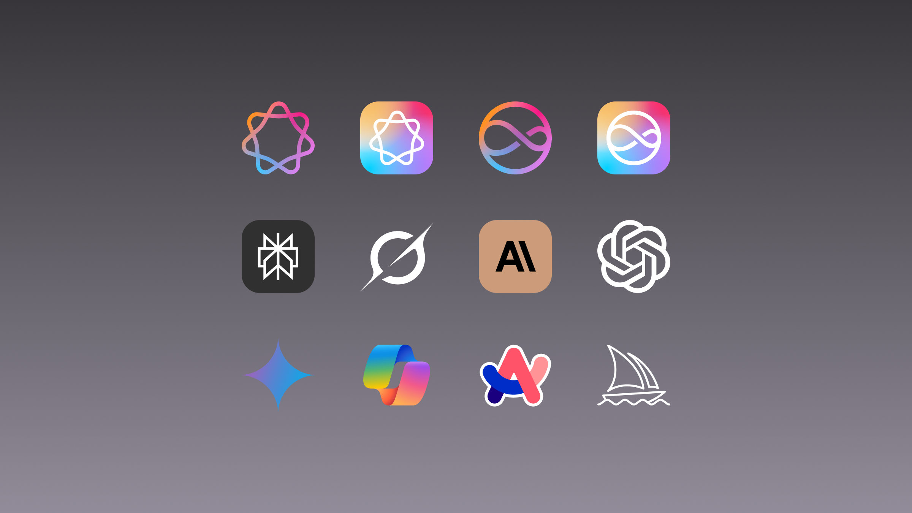

## Introduction

Within today's society, AI has its presence all around us, whether it be in education, entertainment, social media, or the workplace. As AI continues to develop, it has also become increasingly common in education, providing students with tools that can assist with learning, research, problem-solving, and programming. This is especially relevant in Software Engineering, where AI can be used to help write, explain, debug, and improve code. Throughout my experience with AI, I have used tools such as ChatGPT, GitHub Copilot and Grammarly not just to act as a tutor throughout my computer science courses, but also as a second pair of eyes to verify my work.

For instance, I find a joy in expressing myself through words, whether it be on paper or on a screen. Of course, I opt to be more eloquent and struggle to really find that creative side of myself. Sometimes if I feel that a part feels bland or too wordy, I'll oftentimes resort to utilizing AI to ensure that my words do more than just get the point across. And while I commonly use AI for essays like these to fill in that creative gap, I sometimes find myself using it as a tutor to better understand things I feel too embarassed to ask about. Which is why in this essay, I will share my experience with Artificial Intelligence, how it affected my education, and how I might build my future around it.

## Personal Experience with AI:

I will first, share my usage of AI throughout this course through each bullet point

- Experience quizzes: For the experience quizzes or WODs, my AI usage was very minimal, specifically when it came to doing the quizzes. Using course provided tools such as readings, previous modules and sometimes demonstrative videos, I rarely found myself needing to resort to AI. There were some instances where some material wasn't fully provided and the videos didn't seem to help much but lull me into copying them, as a result if I saw something I didn't know about, I would ask AI, specifically ChatGPT about it.
- Practice quizzes: With the practice quizzes, I didn't feel as much pressure
- Quizzes: For the quizzes, my usage in AI lied before and after the quizzes as sort of a coach. Before, to prepare me by refreshing on the topics the quiz may have contained, and after, to analyze what I could have done better or specific issues I had working on the quiz. With the time limit in place, I did feel pressured at times to use AI, but with my prior experience, it also pushed me away as it can be very inconsistent and clunky. This led me to believe it would use more time than it would have to just properly analyze what the quizzes asked of me, that and I felt there was nothing to gain.
- Essays: Surprisingly, this is where most of my AI usage laid throughout this course. As I've said, it is a wonderful tool to put a twist on some parts that seem boring, but also helping you organize your thoughts and have a flow of operations, which is why I almost always used AI to get me in the zone. I rarely ever considered using AI to do the entirety of an essay for me, to me, it would be very boring and likely obvious, but I feel that writing out my experiences has helped me better absorb and recall the skills and terminology throughout this course.
- Final project: Being completely honest, I did find a good amount of parts throughout the final project that forced my hand to reserve my sanity. Having only learned a few of the concepts utilized in the project a few days prior, I felt really weak on the materials and utilized AI to better organize the flow of how I worked with code and how I structured my code. There were instances where autopilot would help within VSCode, which did save me from typing a lot of words and for that, I am thankful.
- Learning a concept / tutorial: I do believe that since I had little to no experience with HTML and websites, I did find myself needing to resort to online resources outside of class, namely Youtube videos and sometimes AI, which did make digesting the content much easier.
- Answering a question in class or in Discord: There were some questions asked by peers that did pertain to some issues I had with some assignments, but impatience led me to use AI to find an answer more quickly.
- Asking or answering a smart-question: I don't want to leave this blank but in respect of everyone else's time and out of embarassment, I never fully utilized SMART questions throughout this course. However, I did use some parts of SMART to formulate a more articulate, and specific question when consulting AI about topics or issues I ran into.
- Coding example e.g. “give an example of using Underscore .pluck”: I did however, use AI to provide more examples on a topic I wasn't too confident with, in an earlier module, I believe with earlier typescript
- Explaining code: For this, I feel that I found myself more lost with some terms throughout the course, leading me have AI explain code to me, especially lines I stumbled upon within the demonstration videos for WODs.
- Writing code: For the larger projects, namely the final and some of your-choice, I did have my work cut out for me, namely during the project, the work was divided amongst two people to design and implement a hiking website and some lines felt very repetitive, especially the add and edit forms. While I did work through the original add and edit forms, I found myself being very lazy and utilizing it to switch it from Events to Hikes, but of course, I double checked to ensure everything was structurally similar.
Documenting code
- Quality assurance e.g. “What’s wrong with this code <code here>” or “Fix the ESLint errors in <code here>”: When I found myself running into issues that I couldn't understand, such as errors I was unfamiliar with, I would through the block of code associated and the error into ChatGPT to better understand what the problem was. I did find myself having to ask about the same error a couple of times, but I eventually learned what to do in response, which is where I felt AI shined. In terms of ESLint I rarely had issues, and if I did the fixes were quite small.
- Other uses in ICS 314 not listed: One thing I did notice that was missing above was more about the professional persona part of this course. While it wasn't a lot, I did consult AI on what to include on my professional portfolio and whether it met the given conditions

  

## Impact on Learning and Understanding:
In my recent years, especially college, I did find myself to have a minimal reliance on AI, mainly using it as a Encyclopedia to learn more I don't know much about. And I'm not referring strictly to ChatGPT but those also implemented in browsers such as Google and Firefox. However, I also feel that this is a good and bad thing as, as soon as I don't know something, I feel an urge to get my answer out of AI before carefully thinking it out. And this, I feel is something a lot of individuals who heavily rely on AI experience, which puts a stop on their overall learning. While this is what I had experienced going into college, I pivoted towards a more tutor-like approach with AI and have challenged myself to tackle topics without AI and consult it afterward if I'm still stumped. And in this course, I do feel that AI has both helped and hurted my learning in this course, since coding ability comes with repetition, my reliance on AI to do something I might have already did (for projects), only robbed me of stronger skills, At the same time, the time it preserved me gave me more time to reflect on concepts without feeling too burned out. 

## Practical Applications:
AI's usefulness isn't limited to assignments or quizzes. The same tools I used in ICS 314 can be applied to larger software projects where developers have to deal with unfamiliar technologies, repetitive code, debugging, and collaboration. In a real software engineering environment, I could see AI being useful for generating boilerplate code, explaining unfamiliar code, finding bugs, writing tests, or helping document a project. From my experience with the final project, I found that AI was most effective when I already had some understanding of what I was trying to accomplish and needed another perspective. While AI can save developers a lot of time, I don't think it can completely replace the developer's judgment, since generated code still needs to be tested and reviewed to make sure it actually works for the project.

## Challenges and Opportunities
While AI might appear like this all powerfull multi-tool, it does has it's limits, especially when it comes to where it gets it's data from. For instance, data could be outdated or even inaccurate, leading to problems created trying to use the tool to make life easier. That's not to take away from the fact that AI could be used as a library of knowledge, and I can 100% I know not even 1% of what AI knows. Even then, I do feel that AIs like ChatGPT can get stuck on an issue but, upon further inspection, was a very minor problem, and that sometimes can ask for more out of you than anything.

  

## Comparative Analysis:

When comparing traditional teaching methods to AI-enhanced learning, I feel that both have their strengths. Traditional teaching forces me to slow down, listen, and actually work through a problem, which I feel helps more with knowledge retention and developing skills through repetition. AI, on the other hand, gives me a much quicker way to ask questions and get explanations that are more specific to what I am struggling with in a very rapid-fire manner. I especially noticed this when learning unfamiliar concepts in ICS 314, where being able to immediately ask AI to explain something in a different way made the material less intimidating. However, I do feel that AI can make learning too convenient, and if I rely on it too much, I can end up understanding an answer without actually knowing how to reach it myself. Because of this, I feel that AI works best alongside traditional teaching rather than replacing it entirely.

## Future Considerations:

Looking toward the future, I am confident AI is not going to disappear from software engineering education, and I honestly don't think it should. As AI becomes more capable, I expect it to become even more useful for tutoring, programming, debugging, and possibly even adapting lessons to each student's weaknesses. At the same time, I think one of the biggest challenges will be teaching students when to use AI and when to put it aside. It is very easy to let AI become a crutch, especially when it can solve a problem in seconds that might take me much longer on my own. Personally, I would like to continue using AI as a second pair of eyes and a tutor, while still making sure I can understand and explain the work without it. If I am going to build my future around software engineering, I feel that knowing how to work with AI will be just as important as knowing when not to use it.

## Conclusion:

Overall, my experience with AI throughout ICS 314 has been a mix of convenience, learning, and realizing where I still need to improve. I found that AI was most useful when I treated it as a tutor or a second pair of eyes rather than something that could simply complete my work for me. It helped me understand unfamiliar concepts, organize my thoughts, debug code, and save time on repetitive tasks, but I also saw how easily that convenience can take away from the repetition and problem-solving that are important for becoming a better software engineer. Because of this, I think future courses should continue allowing AI while also encouraging students to attempt problems independently before relying on it. AI is a powerful tool, but I believe the most important skill is knowing how to use it without letting it replace your own understanding. For me, AI has become less of an answer machine and more of a third perspective, and I think that is where it has the most value in software engineering.
