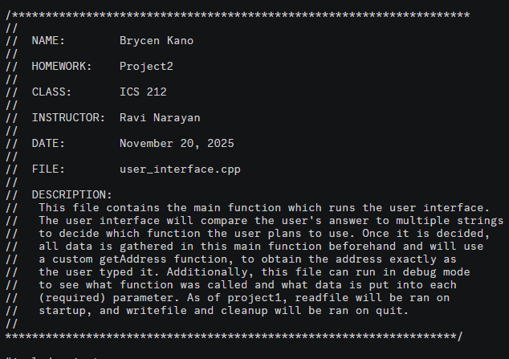

A picture of the top of what a file should contain, representing the required formatting rules to follow.

## What is this project?

The Bank Interface was a semester-long project completed as part of ICS 212, Program Structure. The goal was to create an interactive banking program that allowed users to add, delete, find, and print records stored in an external file. The program demonstrated how data could be written to and retrieved from a file while providing users with an interface to interact with those records.

The project was developed incrementally throughout the semester. I began by learning and implementing individual functions using C before progressively developing the complete interface. These functions were later adapted and implemented in C++, giving me experience working with both languages and understanding some of the differences between them.

## What did I gain from this project?

This project was one of my first substantial experiences working with C and C++, and it challenged me to think more carefully about how individual functions work together to form a complete program. Working with external files also introduced me to handling persistent data rather than relying solely on information stored temporarily while a program was running.

One of the most valuable skills I gained was debugging. When something did not work as expected, I had to analyze my code, identify the source of the problem, and determine how to correct it without breaking other parts of the program. Through this process, I became more comfortable reading my own code and approaching programming problems systematically.

Although the project was challenging at times, completing it gave me greater confidence in my ability to learn unfamiliar programming languages and apply them to a larger project.
