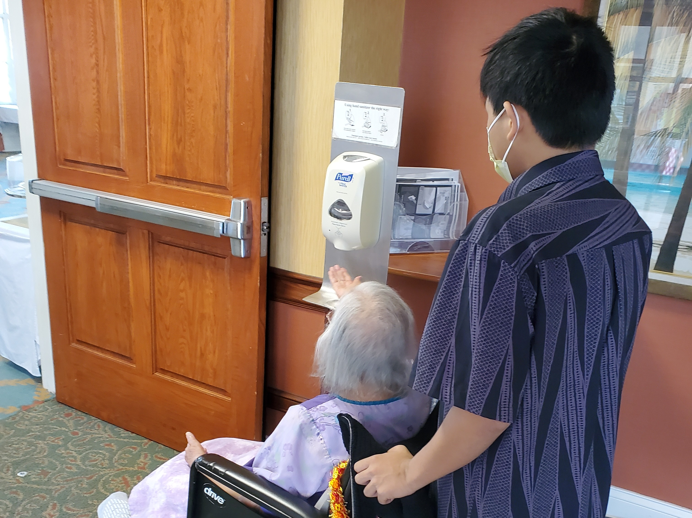

Escorting a resident to the cafeteria for lunch

## What was this project?

During my senior year of high school, I was tasked with finding an internship where I could gain professional experience and develop a senior project around my experience. I ultimately completed my internship at Hale Anuenue, a long-term care facility, where I was supervised while working directly with residents and staff.

My responsibilities included monitoring residents' needs and wellbeing, assisting residents as they moved throughout the facility, and communicating observations and concerns to my supervisor. While these responsibilities were relatively simple, they required patience, attentiveness, and an understanding of how to interact respectfully with individuals who had different needs and circumstances.

## What did I gain from this experience?

This internship gave me my first opportunity to experience a professional work environment and helped me better understand the importance of every individual's role in providing quality care. I developed greater patience, communication skills, and empathy while learning how seemingly small responsibilities can contribute to the overall wellbeing of residents.

More importantly, the experience helped me make a meaningful decision about my future. Near the end of my senior year, I presented my experiences to professionals in the field through several elevator-pitch presentations. Through reflecting on my internship and discussing the field with experienced professionals, I realized that psychology and elder care were not the right career paths for me.

Although I ultimately decided not to pursue this field, the experience was valuable because it taught me that discovering what I *do not* want to pursue can be just as important as discovering what I do. This internship encouraged me to continue exploring different areas until I found a field that better aligned with my interests and strengths.
