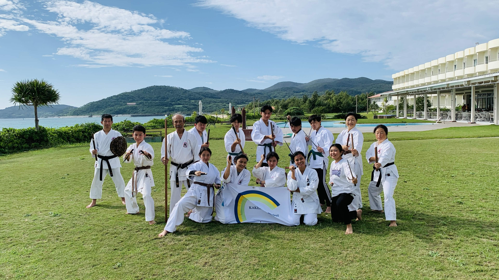
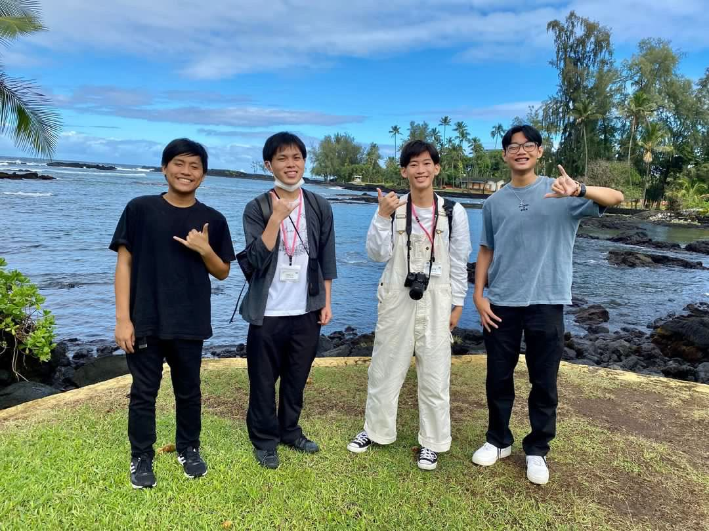

## What was this project?

In Winter 2025, I was selected to participate in the Kakehashi Japan Cultural Exchange Program, an international exchange initiative designed to strengthen cultural understanding and relationships between Japan and the United States. Along with fellow participants from Waiakea High School, I traveled to Kumejima, Okinawa, where I had the opportunity to learn about Japanese culture, community, and everyday life.

As part of the exchange, I was responsible for recording my observations and sharing my findings with those involved in organizing the program. One of the most interesting aspects of the experience was discovering the similarities between Kumejima and the Big Island of Hawaiʻi. Both communities have strong connections to agriculture and their surrounding environments, and both have a more rural atmosphere compared with larger urban areas such as Tokyo and Oʻahu.

These comparisons helped me recognize that cultural differences do not necessarily prevent communities from sharing similar experiences. Although Kumejima and the Big Island are separated by thousands of miles, their relationships with agriculture, the environment, and their local communities felt surprisingly familiar.

## What did I gain from this experience?

During the second half of the exchange, I was assigned two Japanese exchange students from Kumejima and helped show them around the Big Island. This allowed me to experience the exchange from the opposite perspective as I introduced them to places and aspects of Hawaiʻi that were familiar to me. Interestingly, they also recognized similarities between the Big Island and their home in Kumejima.

The experience strengthened my communication skills and taught me to be more open-minded when approaching unfamiliar cultures and environments. It also showed me the value of looking for common ground between people rather than focusing solely on differences.

At the conclusion of the program, I wrote an essay reflecting on the experience and the importance of maintaining a strong relationship between the United States and Japan. Overall, the Kakehashi exchange gave me a greater appreciation for cultural exchange and demonstrated how shared experiences can help build understanding between communities.
